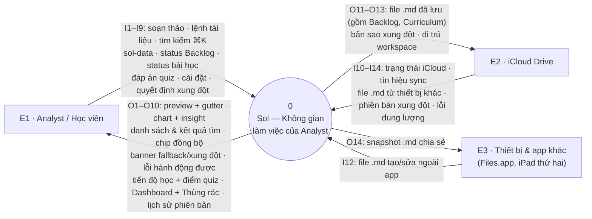
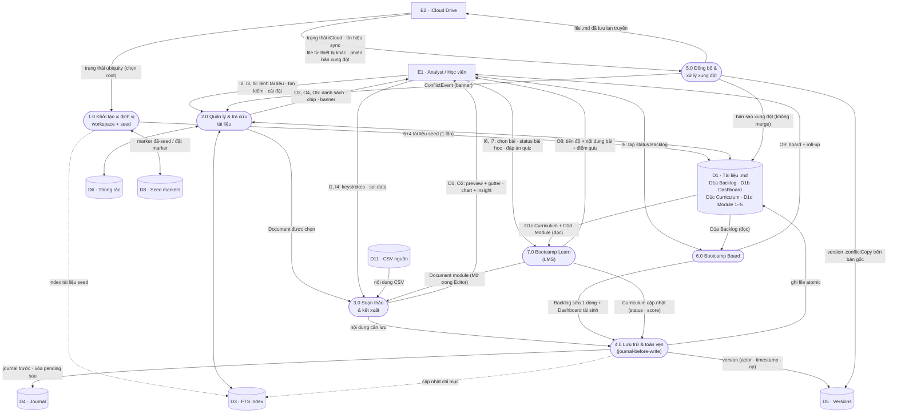
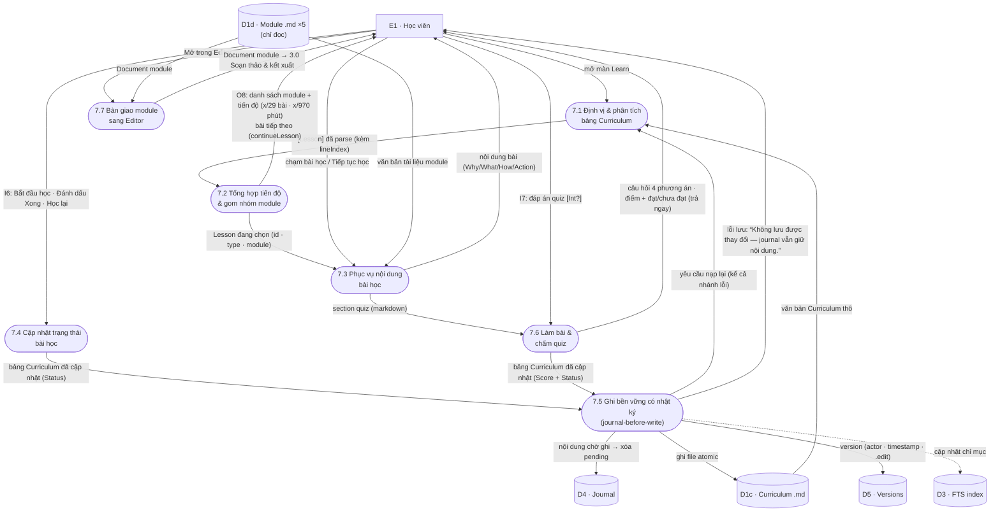

# DFD — Sol iPadOS (v1, gồm Bootcamp Learn)

Sơ đồ luồng dữ liệu (Data Flow Diagram) của app Sol iPadOS, xây dựng theo đúng
quy trình 5 bước và **đối chiếu trực tiếp với code trong repo** (mỗi process,
kho, luồng đều truy được về file nguồn). Phân tích do 3 BA agent thực hiện
song song (Bước 1–2, Bước 3, Bước 4) + 1 agent thẩm định độc lập (Bước 5).

**Ký hiệu** (Yourdon/DeMarco, vẽ bằng mermaid): hình tròn/bo góc = process,
hình chữ nhật = external entity, hình trụ = data store. Luồng nét đứt =
side-effect kỹ thuật (ghi kèm, không phải quyết định nghiệp vụ của process).

**Phạm vi:** app v1. Live Share / Relay Service (`SolCollab`, Cloudflare
Durable Objects) tồn tại trong repo nhưng **ngoài đường biên v1 theo HR-2**
(`project.yml` không link vào app target) — không xuất hiện trong DFD này.

---

## Bước 1 — Xác định đầu vào, đầu ra chính của hệ thống

### External entities (tác nhân ngoài)

| ID | Tác nhân | Căn cứ code |
| --- | --- | --- |
| E1 | **Analyst / Học viên** (single-user trên iPad) | Mọi hành vi khởi phát từ UI: `WorkspaceViewModel` (tạo/xóa/tìm), `EditorViewModel` (gõ phím), `BootcampBoardViewModel`/`LearnViewModel` (status, quiz). APP-NFR-04: chạy được không cần tài khoản iCloud → đây là tác nhân duy nhất bắt buộc |
| E2 | **iCloud Drive** (ubiquity container) | `DefaultUbiquityProvider.status()`, `ICloudSyncEngine` (NSMetadataQuery upload/download), 4 trạng thái `ICloudStatus` |
| E3 | **Thiết bị & ứng dụng khác trên cùng thư mục .md** (iPad thứ hai, Files.app, editor markdown bất kỳ) | `DocumentStore.docID(for:)` self-heal "file appeared outside the app"; `ConflictingVersion.actorName`; `exportSnapshot` → `Snapshots/` để chia sẻ qua Files.app; APP-FR-10 file .md thuần. E3 tương tác chủ yếu **gián tiếp qua E2** |

*Không phải* external entity: mọi kho `.sol-*`, Backlog/Curriculum .md (kho
trong hệ thống); backend telemetry (**không tồn tại ở v1** — `telemetry.jsonl`
chỉ ghi on-device); Relay Service (ngoài phạm vi v1).

### Đầu vào chính (I) — vượt đường biên VÀO hệ thống

Từ E1: **I1** nội dung soạn thảo Markdown (keystroke/edit) · **I2** lệnh vòng
đời tài liệu (tạo · đổi tên · xóa mềm · khôi phục · xóa vĩnh viễn · snapshot) ·
**I3** truy vấn tìm kiếm + lệnh ⌘K · **I4** khối `sol-data` (loại chart + CSV) ·
**I5** tap đổi trạng thái mục Backlog · **I6** tap đổi trạng thái bài học ·
**I7** đáp án quiz · **I8** cài đặt (theme · ngôn ngữ · phím tắt · telemetry) ·
**I9** quyết định xử lý xung đột (xem bản sao / bỏ qua).

Từ E2/E3: **I10** trạng thái khả dụng iCloud (4 trạng thái) · **I11** tín hiệu
tiến trình đồng bộ + trạng thái mạng · **I12** file .md mới/đổi do thiết bị
khác ghi · **I13** phiên bản xung đột (người · thời điểm · nội dung) ·
**I14** lỗi hết dung lượng khi ghi.

### Đầu ra chính (O) — vượt đường biên RA khỏi hệ thống

Tới E1: **O1** live preview + gutter tags · **O2** chart Swift Charts + insight
+ tóm tắt VoiceOver · **O3** danh sách tài liệu / kết quả tìm (bản sao xung đột
có badge) · **O4** chip trạng thái đồng bộ (4 thông điệp) · **O5** banner
fallback cục bộ kèm lý do · **O6** banner xung đột nêu tên file bản sao ·
**O7** thông báo lỗi hành động được (10 MB · hết dung lượng · CSV sai) ·
**O8** tiến độ học tập + điểm quiz (đúng/tổng, ngưỡng 70%) · **O9** Dashboard
Bootcamp tự tính + Thùng rác 30 ngày · **O10** lịch sử phiên bản (ai · lúc nào
· thao tác gì).

Tới E2/E3: **O11** file .md đã lưu (gồm Backlog.md, Curriculum.md đã cập nhật
status/score) · **O12** file bản sao xung đột (.md sibling, không merge —
ADR-A02) · **O13** di trú workspace local → iCloud (copy-then-delete) ·
**O14** snapshot .md trong `Snapshots/` chia sẻ qua Files.app.

---

## Bước 2 — Sơ đồ ngữ cảnh (DFD cấp 0)

Một process duy nhất: **`0 — Sol · Không gian làm việc của Analyst`**
(quản lý tài liệu .md, tìm kiếm FTS, soạn thảo + preview + sol-data, đồng bộ
iCloud + xung đột, Bootcamp Board & Bootcamp Learn).

---

## Bước 3 — DFD cấp 1

Process 0 phân rã thành **7 process con**, bám đúng cấu trúc package:

| # | Process | Trách nhiệm | Package |
| --- | --- | --- | --- |
| 1.0 | Khởi tạo & định vị workspace | Chọn root iCloud/local (APP-FR-15), mở store, purge quá hạn, **seed Bootcamp OS + Learn lần đầu** (marker D8) | SolWorkspace · SolStore · SolBootcamp |
| 2.0 | Quản lý & tra cứu tài liệu | List/tạo/đổi tên/xóa mềm/khôi phục/xóa vĩnh viễn, FTS đ/Đ, ⌘K, Settings | SolWorkspace · SolStore |
| 3.0 | Soạn thảo & kết xuất | Parse Markdown một-lượt → preview + gutter; `sol-data` → chart + insight | SolEditor · SolBlockModel · SolDataBlocks |
| 4.0 | Lưu trữ & toàn vẹn | Bất biến G2: journal TRƯỚC → save atomic → clear → version; phục hồi journal; purge cascade | SolStore |
| 5.0 | Đồng bộ & xử lý xung đột | SyncStatus 3 trạng thái; bản sao xung đột APP-BR-03, **không merge** | SolStore |
| 6.0 | Bootcamp Board | Parse Backlog (D1a), tap-to-update 1 dòng, **tái sinh Dashboard (D1b)** | SolBootcamp |
| 7.0 | Bootcamp Learn (LMS) | Parse Curriculum (D1c), phục vụ bài học từ Module (D1d, chỉ đọc), status + quiz ghi về D1c | SolBootcamp |

### Kho dữ liệu

| ID | Kho | Vị trí thật (`<root>` = iCloud `…/Documents` hoặc `~/Documents/SolWorkspace`) |
| --- | --- | --- |
| D1 | Kho tài liệu Markdown — sub-kho logic theo H1 marker: **D1a** Backlog · **D1b** Dashboard · **D1c** Curriculum · **D1d** Module 1–5 | `<root>/*.md` |
| D2 | Sidecar định danh (UUID ↔ file, self-heal) | `<root>/.sol-ids/` |
| D3 | Chỉ mục FTS5 (fold dấu + đ/Đ) | `<root>/.sol-index.sqlite` |
| D4 | Journal pending (journal-before-write) | `<root>/.sol-journal/` |
| D5 | Lịch sử version (actor/timestamp/operation) | `<root>/.sol-versions/` |
| D6 | Thùng rác (30 ngày) | `<root>/.sol-trash/` |
| D7 | Snapshots xuất ra (read-only) | `<root>/Snapshots/` |
| D8 | Marker seed (2 file: `.sol-seed-bootcamp-v1`, `.sol-seed-learn-v1`) | `<root>/` |
| D9 | Telemetry log (chỉ số, on-device) | `<root>/.sol-telemetry/` |
| D10 | Cấu hình ứng dụng | UserDefaults |
| D11 | CSV nguồn cho `sol-data src=` (chỉ đọc, chặn path escape) | `<root>/data/` |

Luồng chi tiết từng process (đầy đủ, làm căn cứ cân bằng): xem bảng I/O ở
Bước 1 và phân rã ở Bước 4. Ghi chú quan trọng:

- **Mọi process ghi file đều đi qua 4.0** — 2.0/3.0/6.0/7.0 không tự ghi D1.
- 6.0 ghi **hai** kho logic: D1a (sửa 1 dòng) và D1b (tái sinh — output dẫn
  xuất, người dùng xóa thì tạo lại). 7.0 ghi **duy nhất** D1c.
- D9 (telemetry) nhận sự kiện chỉ-số từ 4.0/5.0; D10 (settings) thuộc 2.0;
  D2 (sidecar) và D7 (snapshots) do 4.0/2.0 quản lý — lược khỏi sơ đồ để giữ
  độ đọc được, đầy đủ trong bảng kho.

---

## Bước 4 — DFD cấp 2: phân rã 7.0 Bootcamp Learn

Learn là process mới nhất và nhiều luồng nghiệp vụ nhất — phân rã chi tiết.
(6.0 Board có cấu trúc tương tự, đã ổn định; các process 2.0–5.0 là hạ tầng,
phân rã thêm không tăng giá trị phân tích — dừng ở cấp 2 là đủ chi tiết,
đúng khuyến nghị "thường tới cấp 3 là đủ".)

**Lưu ý số hiệu:** việc seed giáo trình do `WorkspaceViewModel.bootstrap()`
gọi (`LearnSeed.installIfNeeded`), tức thuộc **1.0**, không thuộc 7.0 — nên
Level 2 của 7.0 **không** có sub-process seed (tránh vẽ một process ở hai nơi).

| # | Sub-process | Kích hoạt | Hàm chính |
| --- | --- | --- | --- |
| 7.1 | Định vị & phân tích bảng Curriculum | Mở màn Learn; tự động sau mỗi lần ghi (loopback từ 7.5) | `LearnViewModel.curriculumDocument` · `reload()` · `CurriculumDocument.parse` |
| 7.2 | Tổng hợp tiến độ & gom nhóm module | Hệ quả của 7.1 (cùng `reload()`) | `reload()` phần cuối · `progress` · `continueLesson` |
| 7.3 | Phục vụ nội dung bài học | Học viên chạm bài / "Tiếp tục học" | `moduleDocument(for:)` · `lessonBody(for:)` · `ModuleDocument.section` |
| 7.4 | Cập nhật trạng thái bài học | Chạm "Bắt đầu học" / "Đánh dấu Xong" / "Học lại" | `setStatus` · `CurriculumDocument.settingStatus` (sửa đúng 1 dòng) |
| 7.5 | Ghi bền vững có nhật ký (kernel dùng chung) | Nội bộ — 7.4 và 7.6 đều đi qua | `mutateCurriculum`: `recordPending` → `save` → `clearPending` → `versions.record(.edit)` → `reload()` |
| 7.6 | Làm bài & chấm quiz | Mở dòng Quiz → chạm "Nộp bài" | `quizQuestions` · `QuizTable.parse/grade` · `submitQuiz` · `recordingQuizResult` (≥70% → Done, trượt → In progress) |
| 7.7 | Bàn giao tài liệu module sang Editor | Chạm "Mở trong Editor" | `moduleDocument(for:)` + closure `onOpenDocument` → 3.0 |

*(Mũi tên cuối của 7.7 là luồng xuất qua ranh giới process — ở cấp 1 nó là
`7.0 → 3.0: Document module`.)*

### Bất biến cân bằng dữ liệu (Level 1 ↔ Level 2)

1. Ba luồng vào từ E1 (`chọn bài`, `status bài học`, `đáp án quiz`) không được
   gộp — chúng tới 3 sub-process khác nhau và chỉ 2 luồng sau sinh ghi file.
2. `điểm + kết quả` có 2 đường về học viên ở cấp 2 (trả ngay từ 7.6, và gián
   tiếp qua D1c → 7.1 sau reload) — ở cấp 1 chỉ vẽ **một** luồng O8.
3. D1c là luồng **hai chiều** ở cả 2 cấp (đọc + ghi).
4. D1d **chỉ đọc** sau seed — Learn không bao giờ ghi lại Module (điểm quiz ghi
   vào Curriculum, không ghi vào Module).
5. Khác 6.0 Board: Learn **không** tái sinh Dashboard — không có luồng
   7.0 → D1b ở bất cứ cấp nào.
6. Seed thuộc 1.0 (bootstrap), không xuất hiện trong 7.x.
7. Journal/version/index là 3 luồng "ghi kèm" của cùng hành vi lưu — cấp 1 đi
   qua 4.0, cấp 2 phân rã trong 7.5: cân bằng theo chú thích, không mất luồng.

---

## Bước 5 — Kiểm tra & xác nhận độ chính xác

Checklist thẩm định (do agent thẩm định độc lập thực hiện trên chính tài liệu
này, đối chiếu ngược với code):

- [ ] Mọi external entity/luồng ở cấp 0 đều xuất hiện (không mất, không phát
      sinh mới) khi phân rã xuống cấp 1 — và tương tự cấp 1 ↔ cấp 2 cho 7.0.
- [ ] Không có process nào chỉ có luồng vào hoặc chỉ có luồng ra (black hole /
      miracle).
- [ ] Không có luồng dữ liệu nối trực tiếp hai external entity hoặc hai data
      store không qua process.
- [ ] Mọi data store có ít nhất một process đọc và một process ghi (hoặc ghi
      chú rõ vì sao chỉ một chiều — vd. D1d chỉ đọc sau seed, D9 chỉ ghi ở v1).
- [ ] Nhãn luồng là **dữ liệu** (danh từ), không phải luồng điều khiển.
- [ ] Người chưa đọc code hiểu được hệ thống vận hành thế nào từ sơ đồ.

*Kết quả thẩm định: xem mục dưới (điền sau khi agent Bước 5 chạy xong).*
