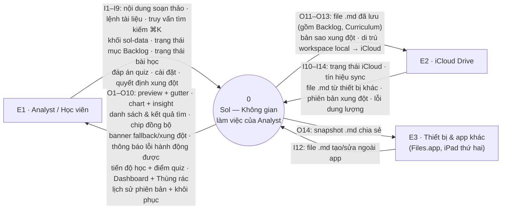
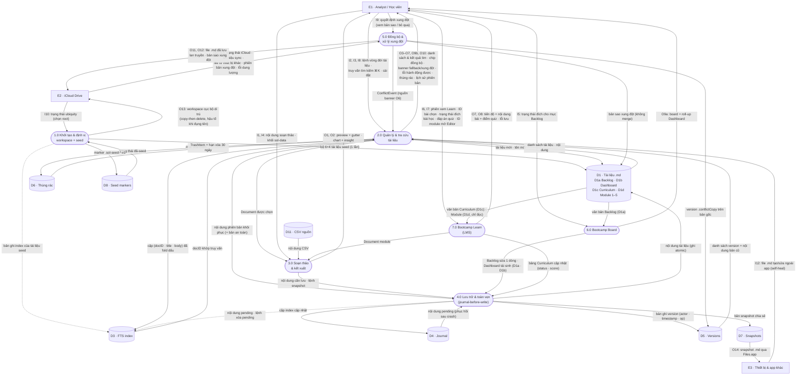
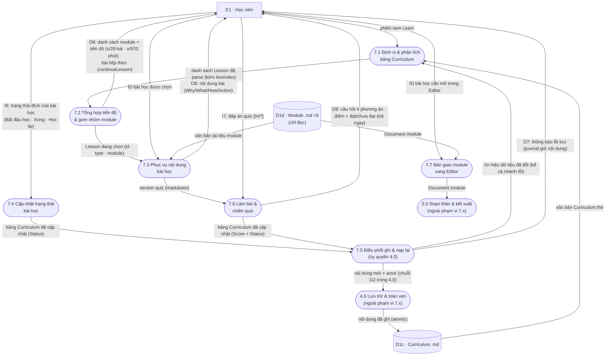

# DFD — Sol iPadOS (v1, gồm Bootcamp Learn)

Sơ đồ luồng dữ liệu (Data Flow Diagram) của app Sol iPadOS, xây dựng theo đúng
quy trình 5 bước và **đối chiếu trực tiếp với code trong repo** (mỗi process,
kho, luồng đều truy được về file nguồn). Phân tích do 3 BA agent thực hiện
song song (Bước 1–2, Bước 3, Bước 4) + 1 agent thẩm định độc lập (Bước 5);
các lỗi cân bằng do agent thẩm định phát hiện đã được sửa trong bản này.

**Ký hiệu** (Yourdon/DeMarco, vẽ bằng mermaid): hình tròn/bo góc = process,
hình chữ nhật = external entity, hình trụ = data store. Luồng nét đứt =
side-effect kỹ thuật (ghi kèm theo `createDocument`/`save`, không phải quyết
định nghiệp vụ của process). Node có ghi "(ngoài phạm vi …)" = process ở cấp
trên, vẽ lại làm ranh giới. Bốn kho hạ tầng **D2/D9/D10** chỉ xuất hiện trong
bảng kho (không vẽ) để giữ độ đọc được — xem cột "Vị trí thật".

**Phạm vi:** app v1. Live Share / Relay Service (`SolCollab`, Cloudflare
Durable Objects) tồn tại trong repo nhưng **ngoài đường biên v1 theo HR-2**
(`project.yml` không link vào app target) — không xuất hiện trong DFD này.

---

## Bước 1 — Xác định đầu vào, đầu ra chính của hệ thống

### External entities (tác nhân ngoài)

| ID | Tác nhân | Căn cứ code |
| --- | --- | --- |
| E1 | **Analyst / Học viên** (single-user trên iPad) | Mọi hành vi khởi phát từ UI: `WorkspaceViewModel` (tạo/xóa/tìm), `EditorViewModel` (gõ phím), `BootcampBoardViewModel`/`LearnViewModel` (status, quiz). APP-NFR-04: chạy được không cần tài khoản iCloud → đây là tác nhân duy nhất bắt buộc |
| E2 | **iCloud Drive** (ubiquity container) | `DefaultUbiquityProvider.status()`, `ICloudSyncEngine` (NSMetadataQuery upload/download), 4 trạng thái `ICloudStatus` |
| E3 | **Thiết bị & ứng dụng khác trên cùng thư mục .md** (iPad thứ hai, Files.app, editor markdown bất kỳ) | `DocumentStore.docID(for:)` self-heal "file appeared outside the app"; `ConflictingVersion.actorName`; `exportSnapshot` → `Snapshots/` để chia sẻ qua Files.app; APP-FR-10 file .md thuần. E3 tương tác chủ yếu **gián tiếp qua E2** |

*Không phải* external entity: mọi kho `.sol-*`, Backlog/Curriculum .md (kho
trong hệ thống); backend telemetry (**không tồn tại ở v1** — `telemetry.jsonl`
chỉ ghi on-device); Relay Service (ngoài phạm vi v1).

### Đầu vào chính (I) — vượt đường biên VÀO hệ thống

Từ E1: **I1** nội dung soạn thảo Markdown (keystroke/edit) · **I2** lệnh vòng
đời tài liệu (tạo · đổi tên · xóa mềm · khôi phục · xóa vĩnh viễn · snapshot) ·
**I3** truy vấn tìm kiếm + lệnh ⌘K · **I4** khối `sol-data` (loại chart + CSV) ·
**I5** trạng thái đích cho mục Backlog · **I6** trạng thái đích cho bài học ·
**I7** đáp án quiz · **I8** cài đặt (theme · ngôn ngữ · phím tắt · telemetry) ·
**I9** quyết định xử lý xung đột (xem bản sao / bỏ qua).

Từ E2/E3: **I10** trạng thái khả dụng iCloud (4 trạng thái) · **I11** tín hiệu
tiến trình đồng bộ + trạng thái mạng · **I12** file .md mới/đổi do thiết bị
khác ghi · **I13** phiên bản xung đột (người · thời điểm · nội dung) ·
**I14** lỗi hết dung lượng khi ghi.

### Đầu ra chính (O) — vượt đường biên RA khỏi hệ thống

Tới E1: **O1** live preview + gutter tags · **O2** chart Swift Charts + insight
+ tóm tắt VoiceOver · **O3** danh sách tài liệu / kết quả tìm (bản sao xung đột
có badge) · **O4** chip trạng thái đồng bộ (4 thông điệp) · **O5** banner
fallback cục bộ kèm lý do · **O6** banner xung đột nêu tên file bản sao ·
**O7** thông báo lỗi hành động được (10 MB · hết dung lượng · CSV sai · lỗi
lưu Board/Learn: "Không lưu được thay đổi — journal vẫn giữ nội dung.") ·
**O8** tiến độ học tập + nội dung bài + điểm quiz (đúng/tổng, ngưỡng 70%) ·
**O9a** Dashboard Bootcamp tự tính · **O9b** Thùng rác 30 ngày kèm hạn xóa ·
**O10** lịch sử phiên bản (ai · lúc nào · thao tác) — màn Lịch sử phiên bản từ
context menu S1, kèm khôi phục có lưới an toàn *(nối vào v1 sau thẩm định
Bước 5 — `VersionHistoryView`)*.

Tới E2/E3: **O11** file .md đã lưu (gồm Backlog.md, Curriculum.md đã cập nhật
status/score) · **O12** file bản sao xung đột (.md sibling, không merge —
ADR-A02) · **O13** di trú workspace local → iCloud (copy-then-delete, đụng
tên lấy hậu tố số) *(nối vào bootstrap sau thẩm định Bước 5 —
`WorkspaceLocation.migrateIfNeeded`)* · **O14** snapshot .md trong
`Snapshots/` chia sẻ qua Files.app.

---

## Bước 2 — Sơ đồ ngữ cảnh (DFD cấp 0)

Một process duy nhất: **`0 — Sol · Không gian làm việc của Analyst`**
(quản lý tài liệu .md, tìm kiếm FTS, soạn thảo + preview + sol-data, đồng bộ
iCloud + xung đột, Bootcamp Board & Bootcamp Learn).

---

## Bước 3 — DFD cấp 1

Process 0 phân rã thành **7 process con**, bám đúng cấu trúc package:

| # | Process | Trách nhiệm | Package |
| --- | --- | --- | --- |
| 1.0 | Khởi tạo & định vị workspace | Chọn root iCloud/local (APP-FR-15), mở store, purge quá hạn, **seed Bootcamp OS + Learn lần đầu** (marker D8) | SolWorkspace · SolStore · SolBootcamp |
| 2.0 | Quản lý & tra cứu tài liệu | List/tạo/đổi tên/xóa mềm/khôi phục/xóa vĩnh viễn, FTS đ/Đ, ⌘K, Settings; self-heal file đến từ ngoài app | SolWorkspace · SolStore |
| 3.0 | Soạn thảo & kết xuất | Parse Markdown một-lượt → preview + gutter; `sol-data` → chart + insight | SolEditor · SolBlockModel · SolDataBlocks |
| 4.0 | Lưu trữ & toàn vẹn | Đường **cập nhật** tài liệu theo bất biến G2: journal TRƯỚC → save atomic → clear → version; phục hồi journal sau crash; snapshot; purge cascade. *(Đường **tạo mới** — `createDocument` — chỉ ghi file + index, không journal/version.)* | SolStore |
| 5.0 | Đồng bộ & xử lý xung đột | SyncStatus 3 trạng thái; bản sao xung đột APP-BR-03, **không merge** | SolStore |
| 6.0 | Bootcamp Board | Parse Backlog (D1a), sửa status đúng 1 dòng, **tái sinh Dashboard (D1b)** | SolBootcamp |
| 7.0 | Bootcamp Learn (LMS) | Parse Curriculum (D1c), phục vụ bài học từ Module (D1d, chỉ đọc), status + quiz ghi về D1c qua 4.0 | SolBootcamp |

*Ghi chú mô hình hóa:* 4.0 là process logic hiện thân bằng **API SolStore**
được các process khác gọi trong-tiến-trình (`journal.recordPending` → `save`
→ `clearPending` → `versions.record`), không phải tiến trình chạy riêng.
Mọi đường **cập nhật** file của 2.0/3.0/6.0/7.0 đều đi qua 4.0.

### Kho dữ liệu

| ID | Kho | Vị trí thật (`<root>` = iCloud `…/Documents` hoặc `~/Documents/SolWorkspace`) |
| --- | --- | --- |
| D1 | Kho tài liệu Markdown — sub-kho logic theo H1 marker: **D1a** Backlog · **D1b** Dashboard · **D1c** Curriculum · **D1d** Module 1–5 | `<root>/*.md` |
| D2 | Sidecar định danh (UUID ↔ file, self-heal) — *chỉ trong bảng* | `<root>/.sol-ids/` |
| D3 | Chỉ mục FTS5 (fold dấu + đ/Đ) | `<root>/.sol-index.sqlite` |
| D4 | Journal pending (journal-before-write) | `<root>/.sol-journal/` |
| D5 | Lịch sử version (actor/timestamp/operation) — đọc bởi 2.0 (màn Lịch sử phiên bản, O10) | `<root>/.sol-versions/` |
| D6 | Thùng rác (30 ngày) | `<root>/.sol-trash/` |
| D7 | Snapshots xuất ra (read-only, chia sẻ qua Files.app) | `<root>/Snapshots/` |
| D8 | Marker seed (2 file: `.sol-seed-bootcamp-v1`, `.sol-seed-learn-v1`) | `<root>/` |
| D9 | Telemetry log (chỉ số, on-device) — **chỉ-ghi ở v1**, *chỉ trong bảng* | `<root>/.sol-telemetry/` |
| D10 | Cấu hình ứng dụng — *chỉ trong bảng* | UserDefaults |
| D11 | CSV nguồn cho `sol-data src=` — chỉ đọc trong app; **E3 ghi từ ngoài đường biên** (Files.app) | `<root>/data/` |

### Bảng luồng cấp 1 (căn cứ cân bằng)

| Từ | Tới | Dữ liệu | Mã cấp 0 |
| --- | --- | --- | --- |
| E2 | 1.0 | Trạng thái ubiquity (chọn root) | I10 |
| 1.0 | E2 | Workspace cục bộ di trú vào container (copy-then-delete) | O13 |
| 1.0 | D1 | Bộ 6+4 tài liệu seed (1 lần) | — |
| D8 | 1.0 | Trạng thái đã-seed | — |
| 1.0 | D8 | Marker `.sol-seed-*-v1` | — |
| 1.0 | D3 | Bản ghi index tài liệu seed *(side-effect)* | — |
| E1 | 2.0 | Lệnh vòng đời tài liệu · truy vấn tìm kiếm · cài đặt | I2, I3, I8 |
| 2.0 | D1 | Tài liệu mới · tên mới | — |
| D1 | 2.0 | Danh sách tài liệu · nội dung | — |
| 2.0 | D3 | Cặp (docID · title · body) đã fold dấu | — |
| D3 | 2.0 | docID khớp truy vấn | — |
| 2.0 | D6 | Mục xóa mềm | — |
| D6 | 2.0 | TrashItem + hạn xóa 30 ngày | — |
| E3 | 2.0 | File .md tạo/sửa ngoài app (self-heal sidecar + index) | I12 |
| D5 | 2.0 | Danh sách version + nội dung bản cũ | — |
| 2.0 | 4.0 | Nội dung phiên bản khôi phục (+ bản an toàn `.edit`) | — |
| 2.0 | E1 | Danh sách & kết quả tìm · chip · banner · lỗi · thùng rác · lịch sử phiên bản | O3–O7, O9b, O10 |
| 2.0 | 3.0 | Document được chọn | — |
| E1 | 3.0 | Nội dung soạn thảo · khối sol-data | I1, I4 |
| D11 | 3.0 | Nội dung CSV | — |
| 3.0 | E1 | Preview + gutter · chart + insight | O1, O2 |
| 3.0 | 4.0 | Nội dung cần lưu · lệnh snapshot | — |
| 4.0 | D4 | Nội dung pending · lệnh xóa pending | — |
| D4 | 4.0 | Nội dung pending (phục hồi sau crash) | — |
| 4.0 | D1 | Nội dung tài liệu (ghi atomic) | — |
| 4.0 | D5 | Bản ghi version (actor · timestamp · operation) | — |
| 4.0 | D3 | Cặp index cập nhật *(side-effect)* | — |
| 4.0 | D7 | Bản snapshot chia sẻ | — |
| D7 | E3 | Snapshot .md qua Files.app | O14 |
| E2 | 5.0 | Trạng thái iCloud · tín hiệu sync · file thiết bị khác · phiên bản xung đột · lỗi dung lượng | I10–I14 |
| E1 | 5.0 | Quyết định xử lý xung đột | I9 |
| 5.0 | D1 | Bản sao xung đột (không merge) | — |
| 5.0 | D5 | Version `.conflictCopy` trên bản gốc | — |
| 5.0 | 2.0 | ConflictEvent (nguồn banner O6) | — |
| 5.0 | E2 | File .md đã lưu lan truyền · bản sao xung đột | O11, O12 |
| E1 | 6.0 | Trạng thái đích cho mục Backlog | I5 |
| D1 | 6.0 | Văn bản Backlog (D1a) | — |
| 6.0 | 4.0 | Backlog sửa 1 dòng · Dashboard tái sinh (D1a · D1b) | — |
| 6.0 | E1 | Board + roll-up Dashboard | O9a |
| E1 | 7.0 | Phiên xem Learn · ID bài chọn · trạng thái đích bài học · đáp án quiz · ID module mở Editor | I6, I7 |
| D1 | 7.0 | Văn bản Curriculum (D1c) · Module (D1d, chỉ đọc) | — |
| 7.0 | 4.0 | Bảng Curriculum cập nhật (status · score) | — |
| 7.0 | E1 | Tiến độ + nội dung bài + điểm quiz · lỗi lưu | O8, O7 |
| 7.0 | 3.0 | Document module | — |

---

## Bước 4 — DFD cấp 2: phân rã 7.0 Bootcamp Learn

Learn là process mới nhất và nhiều luồng nghiệp vụ nhất — phân rã chi tiết.
(6.0 Board có cấu trúc tương tự, đã ổn định; các process 2.0–5.0 là hạ tầng,
phân rã thêm không tăng giá trị phân tích — dừng ở cấp 2 là đủ chi tiết,
đúng khuyến nghị "thường tới cấp 3 là đủ".)

**Lưu ý số hiệu:** việc seed giáo trình do `WorkspaceViewModel.bootstrap()`
gọi (`LearnSeed.installIfNeeded`), tức thuộc **1.0**, không thuộc 7.0 — nên
Level 2 của 7.0 **không** có sub-process seed (tránh vẽ một process ở hai nơi).

| # | Sub-process | Kích hoạt | Hàm chính |
| --- | --- | --- | --- |
| 7.1 | Định vị & phân tích bảng Curriculum | Mở màn Learn; tự động sau mỗi lần ghi (loopback từ 7.5) | `LearnViewModel.curriculumDocument` · `reload()` · `CurriculumDocument.parse` |
| 7.2 | Tổng hợp tiến độ & gom nhóm module | Hệ quả của 7.1 (cùng `reload()`) | `reload()` phần cuối · `progress` · `continueLesson` |
| 7.3 | Phục vụ nội dung bài học | Học viên chạm bài / "Tiếp tục học" | `moduleDocument(for:)` · `lessonBody(for:)` · `ModuleDocument.section` |
| 7.4 | Cập nhật trạng thái bài học | Chạm "Bắt đầu học" / "Đánh dấu Xong" / "Học lại" | `setStatus` · `CurriculumDocument.settingStatus` (sửa đúng 1 dòng) |
| 7.5 | Điều phối ghi & nạp lại (ủy quyền 4.0) | Nội bộ — 7.4 và 7.6 đều đi qua | `mutateCurriculum`: gửi nội dung mới sang 4.0 (chuỗi G2 journal → save → clear → version), phát lỗi nếu có, yêu cầu 7.1 nạp lại |
| 7.6 | Làm bài & chấm quiz | Mở dòng Quiz → chạm "Nộp bài" | `quizQuestions` · `QuizTable.parse/grade` · `submitQuiz` · `recordingQuizResult` (≥70% → Done, trượt → In progress) |
| 7.7 | Bàn giao tài liệu module sang Editor | Chạm "Mở trong Editor" | `moduleDocument(for:)` + closure `onOpenDocument` → 3.0 |

*Ghi chú:* trong code, chuỗi G2 nằm ngay trong `mutateCurriculum`
(`LearnViewModel.swift`) gọi thẳng API SolStore — 7.5 là điểm ủy quyền vào
process logic 4.0, nhất quán với mô hình cấp 1 (7.0 → 4.0 → D1c).

### Bất biến cân bằng dữ liệu (Level 1 ↔ Level 2) — đã thẩm định

1. **Năm** luồng vào từ E1 (phiên xem Learn · ID bài chọn · trạng thái đích ·
   đáp án quiz · ID module mở Editor) — cấp 1 gộp trong một mũi tên có nhãn
   liệt kê đủ cả năm.
2. `điểm + kết quả` có 2 đường về học viên ở cấp 2 (trả ngay từ 7.6, và gián
   tiếp qua D1c → 7.1 sau reload) — ở cấp 1 chỉ vẽ **một** luồng O8.
3. D1c được **đọc trực tiếp** (D1c → 7.1) và **ghi qua 4.0** (7.5 → 4.0 →
   D1c) — nhất quán ở cả hai cấp (cấp 1: D1 → 7.0 và 7.0 → 4.0 → D1).
4. D1d **chỉ đọc** sau seed — Learn không bao giờ ghi lại Module (điểm quiz ghi
   vào Curriculum, không ghi vào Module).
5. Khác 6.0 Board: Learn **không** tái sinh Dashboard — không có luồng
   7.x → D1b ở bất cứ cấp nào.
6. Seed thuộc 1.0 (bootstrap), không xuất hiện trong 7.x.
7. Journal/version/index thuộc 4.0 ở **cả hai cấp** — sơ đồ 7.x không vẽ lại
   D4/D5/D3 (tránh nhân đôi kho); chuỗi G2 mô tả trong hàng 7.5 và ghi chú.
8. Luồng lỗi lưu (7.5 → E1) cân bằng với `7.0 → E1: O7` ở cấp 1 và định nghĩa
   O7 ở cấp 0.
9. `Document module` (7.7 → 3.0) cân bằng với `7.0 → 3.0` ở cấp 1 — vẽ bằng
   node ranh giới, không trỏ nhầm vào E1.

---

## Bước 5 — Kiểm tra & xác nhận độ chính xác

Thẩm định do agent độc lập thực hiện trên bản nháp, đối chiếu ngược với code.
**Kết luận: ĐẠT SAU KHI SỬA** — toàn bộ nhóm LỖI và CẢNH BÁO đã được sửa
trong bản này.

### Checklist

- [x] **Cân bằng cấp 0 ↔ cấp 1** — bản nháp mất E3 + 5 luồng (I9, I14, O7,
      O10, O13); đã sửa: E3/D7 vào sơ đồ cấp 1, thêm I9 (E1 → 5.0), I14 vào
      nhãn E2 → 5.0, O7 vào nhãn 2.0/7.0 → E1; O10 và O13 xác minh là **chưa
      nối vào v1** tại thời điểm thẩm định (versions.list chỉ gọi từ test;
      `migrate` không có caller production) → phát hiện này trở thành backlog
      và **đã được phát triển ngay sau đó**: `VersionHistoryView` (O10) +
      `WorkspaceLocation.migrateIfNeeded` trong bootstrap (O13); sơ đồ đã vẽ
      lại hai luồng này.
- [x] **Cân bằng cấp 1 ↔ cấp 2 (7.0)** — bản nháp mâu thuẫn mô hình ghi
      (cấp 1 qua 4.0, cấp 2 ghi thẳng kho); đã thống nhất: 4.0 là process
      logic dùng chung, cấp 2 vẽ node ranh giới 4.0, bỏ D4/D5/D3 khỏi sơ đồ
      7.x. Mũi tên 7.7 trỏ nhầm E1 → đã trỏ đúng node ranh giới 3.0.
      Bất biến #1 sửa "ba" → "năm" luồng vào.
- [x] **Không có black hole / miracle** — 7 process cấp 1 và 7 sub-process
      cấp 2 đều có luồng vào và ra.
- [x] **Không có luồng entity↔entity hay store↔store** không qua process.
- [x] **Kho có người đọc + người ghi** — đã thêm D4 → 4.0 (phục hồi journal)
      và D5 → 2.0 (màn Lịch sử phiên bản); miễn trừ có chú thích: D1d chỉ đọc
      sau seed · D9 chỉ-ghi ở v1 · D11 do E3 ghi từ ngoài đường biên.
- [x] **Nhãn luồng là danh từ dữ liệu** — đã danh-từ-hóa (~9 nhãn động từ:
      "mở màn Learn" → "phiên xem Learn", "chạm bài học" → "ID bài học được
      chọn", "cập nhật chỉ mục" → "cặp index cập nhật", …), tách 3 luồng
      hai chiều không nhãn thành 6 luồng có nhãn.
- [x] **Độ chính xác so với code: 10/10 claim cốt lõi khớp** — Learn chỉ ghi
      D1c; Board tái sinh D1b; thứ tự G2 journal → save → clear → version;
      ngưỡng quiz 70%, trượt → In progress; seed gọi từ `bootstrap()`;
      Module chỉ đọc; `continueLesson` = bài đầu chưa Xong; bản sao xung đột
      không merge; 29 mục / 970 phút. Một tinh chỉnh theo thẩm định: G2 chỉ
      phủ đường **cập nhật**; `createDocument` (tạo mới) không journal/version
      — đã ghi chú ở hàng 4.0.
- [x] **Người chưa đọc code hiểu được hệ thống** — đã thêm bảng luồng cấp 1
      đầy đủ (căn cứ cân bằng), nhãn kèm cụm danh từ thay vì chỉ mã I/O,
      chú giải các kho chỉ-có-trong-bảng.

### Hạn chế còn ghi nhận (không chặn)

- ~~O10 và O13 là đầu ra tiềm năng~~ — **đã phát triển**: màn Lịch sử phiên
  bản (context menu S1 → xem version theo actor/thao tác → khôi phục có lưới
  an toàn không-mất-chữ) và di trú local → iCloud tự động ở bootstrap
  (best-effort, chạy lại được sau lỗi giữa chừng). Sơ đồ cấp 0/1 đã cập nhật
  (D5 → 2.0 và 1.0 → E2) — đúng vòng đời DFD: thẩm định phát hiện lỗ hổng,
  lỗ hổng thành backlog, code đổi thì sơ đồ đổi theo.
- DFD cấp 2 chỉ phân rã 7.0; nếu cần dạy/thẩm định 6.0 Board, phân rã tương
  tự (6.1 parse → 6.2 roll-up → 6.3 sửa status → 6.4 tái sinh Dashboard →
  6.5 ủy quyền 4.0).
